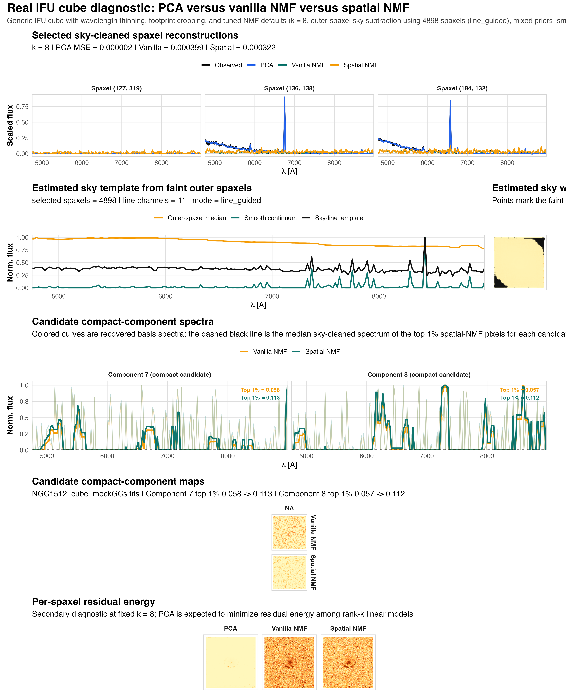

```{r}
summary_path <- "data/ngc1512-benchmark-summary.csv"
component_path <- "data/ngc1512-benchmark-components.csv"
bench <- if (file.exists(summary_path)) read.csv(summary_path, stringsAsFactors = FALSE) else NULL
bench_components <- if (file.exists(component_path)) read.csv(component_path, stringsAsFactors = FALSE) else NULL
```

## Real-Cube Benchmark

This benchmark uses `NGC1512_cube_mockGCs.fits`, a mixed cube containing
extended galaxy structure, compact GC-like sources, and sky contamination in
the same field. It is designed to answer two practical questions:

1. How much reconstruction quality is lost relative to PCA?
2. Does the mixed smooth+sparse spatial prior produce more concentrated compact components than vanilla NMF?

<div class="benchmark-note">
The benchmark uses outer-spaxel sky subtraction, weighted spatial smoothing for
extended components, and sparse priors for the designated compact components.
</div>

## Current Figure

The saved figure emphasizes the candidate compact components, their
component-weight maps, and a residual-energy comparison at fixed rank.

```{r}
if (file.exists("images/ngc1512-benchmark.png")) {
  
} else {
  cat("Benchmark figure not found in `site/images/ngc1512-benchmark.png`.\n")
}
```

## Summary Metrics

```{r}
if (!is.null(bench)) {
  bench$mse <- signif(bench$mse, 4)
  bench$mean_top1pct <- signif(bench$mean_top1pct, 4)
  bench$mean_top5pct <- signif(bench$mean_top5pct, 4)
  bench$sparse_top1pct <- signif(bench$sparse_top1pct, 4)
  bench$sparse_top5pct <- signif(bench$sparse_top5pct, 4)
  knitr::kable(
    bench[, c("model", "mse", "mean_top1pct", "mean_top5pct", "sparse_top1pct", "sparse_top5pct")],
    caption = "Current NGC1512 benchmark summary."
  )
} else {
  cat("Benchmark summary CSV not found.\n")
}
```

`mean_top1pct` and `mean_top5pct` measure how much component-weight mass is
carried by the brightest 1% or 5% of map pixels. Higher values indicate more
concentrated maps. For the designated sparse components, the
`sparse_top1pct` and `sparse_top5pct` columns isolate that concentration test.

## How To Read The Figure

- The reconstruction panel checks whether the mixed prior preserves acceptable spaxel-level fits.
- The compact-component spectra panel is diagnostic only: on this mixed cube the recovered basis spectra are still not clean astrophysical templates, so the main comparison is relative rather than interpretive.
- The compact-component maps panel is the main spatial diagnostic for whether the sparse prior is isolating localized structure.
- The residual-energy panel is secondary: PCA is expected to win on pure rank-\(k\) squared-error reconstruction.

```{r}
if (!is.null(bench)) {
  vanilla_row <- bench[bench$model == "Vanilla NMF", , drop = FALSE]
  spatial_row <- bench[bench$model == "Spatial NMF", , drop = FALSE]
  cat(
    sprintf(
      "In the current saved run, spatial NMF improves the vanilla NMF reconstruction MSE from %.4g to %.4g, while increasing the designated sparse-component top-1%% concentration from %.3f to %.3f.",
      vanilla_row$mse,
      spatial_row$mse,
      vanilla_row$sparse_top1pct,
      spatial_row$sparse_top1pct
    )
  )
}
```

## Recommended Settings

The current benchmark run uses:

- `k = 8`
- outer-spaxel sky subtraction
- `lambda_smooth` for spectral regularization
- Gaussian spatial coupling for smooth components
- sparse priors on the compact-source components

## Interpretation

PCA remains the strongest baseline for pure rank-\(k\) squared-error
reconstruction, so the main question is not whether NMF beats PCA on MSE alone.
The relevant question is whether spatial NMF preserves acceptable
reconstruction quality while yielding cleaner and more interpretable
component-weight maps.
