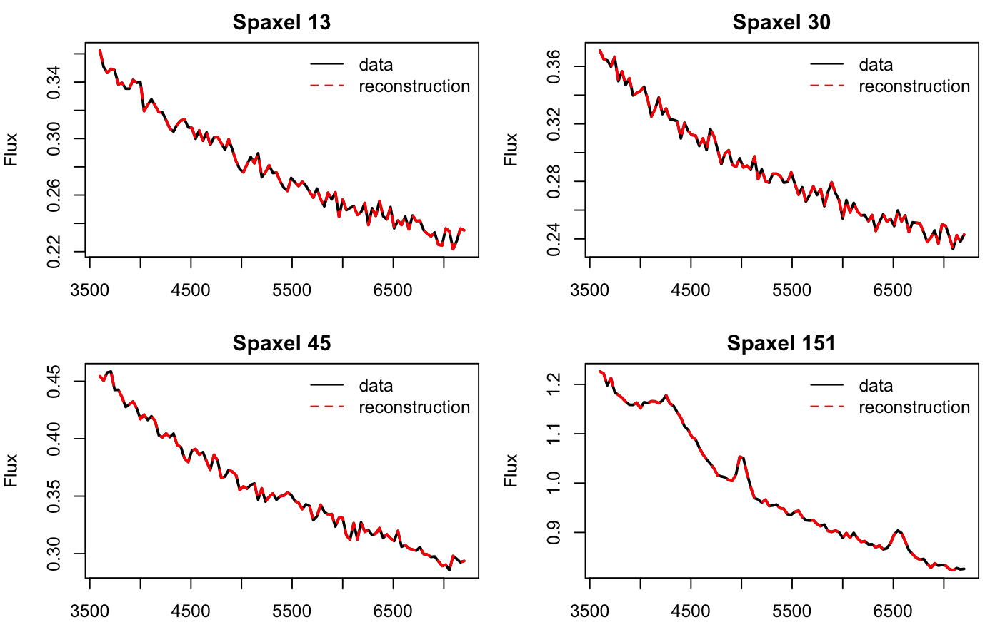

```{r}
library(SpaxNMF)
```

## Quick Start

The example below uses the bundled synthetic IFU cube to illustrate the basic
workflow from matrix input to interpreted component spectra and maps.

```{r, eval = FALSE}
demo <- simulate_ifu_cube(nx = 16, ny = 16, n_wave = 100)
```

## Fit the model

```{r, eval = FALSE}
fit <- spax_nmf(
  demo$matrix,
  k = 3,
  lambda_smooth = 0.02,
  lambda_spatial = 0.01,
  nx = demo$nx,
  ny = demo$ny,
  niter = 300,
  lr = 0.03
)
```

## Inspect the fit

```{r, eval = FALSE}
print(fit)
summary(fit)
basis(fit)
coef(fit)
```

## Plot the outputs

```{r, eval = FALSE}
plot(fit, type = "spectra", wavelength = demo$wavelength)
plot(fit, type = "maps", nx = demo$nx, ny = demo$ny)
plot(fit, type = "loss")
plot_reconstruction(fit, demo$matrix, n = 4, wavelength = demo$wavelength)
```

## Example figures

Component spectra:


Component maps:


Observed versus reconstructed spectra:



## What the outputs mean

- `fit$spatial` contains one component weight per spaxel and per component.
- `fit$spectra` contains the recovered component spectra.
- `fit$reconstruction` is the model approximation `A %*% S`.
- `fit$loss` stores the optimization history.
- `fitted(fit, nx, ny)` and `predict(fit, type = "cube", nx, ny)` reshape that
  reconstruction back into a cube.
- `residuals(fit, x = ...)` returns data minus reconstruction.

## Real-data examples

The same workflow can be applied to curated survey cubes in order to compare:

- PCA components
- vanilla NMF components
- spatial NMF components

using a consistent component-spectrum figure and matched preprocessing across
methods.
