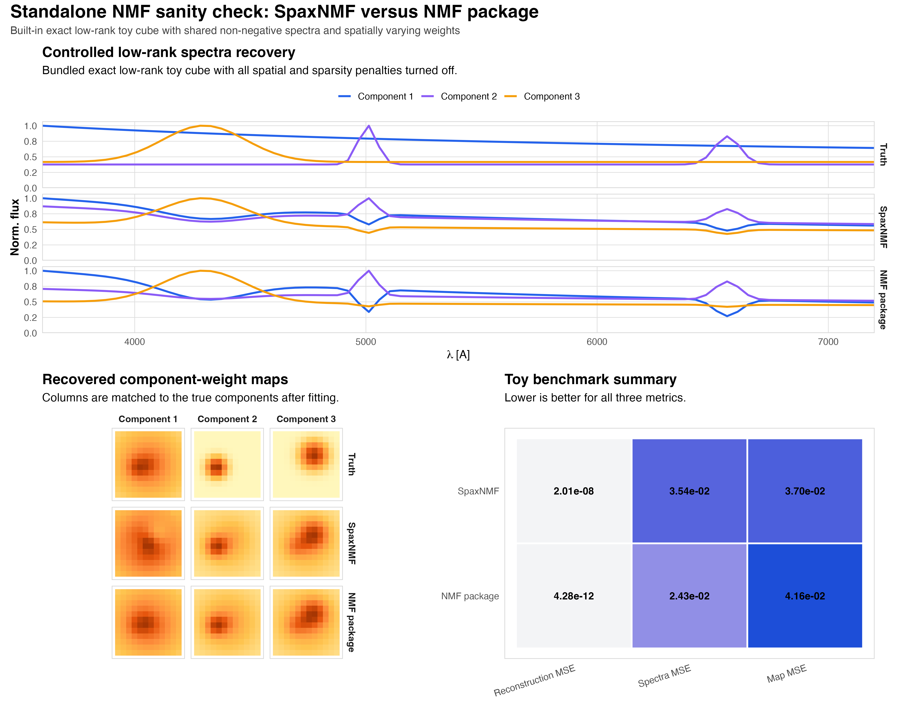

```{r}
toy_summary_path <- "data/toy-nmf-benchmark-summary.csv"
toy_bench <- if (file.exists(toy_summary_path)) {
  read.csv(toy_summary_path, stringsAsFactors = FALSE)
} else {
  NULL
}
```

## Controlled Sanity Check

This page isolates the base matrix factorization problem from the full IFU
stress tests. The toy data are constructed to be exactly low-rank, with
non-negative component spectra and non-negative spatial weights. Spatial and
sparsity penalties are turned off for `spax_nmf()`, so this comparison checks
the standalone vanilla NMF fit directly against `NMF::nmf()`. Under these
conditions `spax_nmf()` still uses the torch-based Adam optimizer, with all
regularization weights set to zero, so the comparison checks the actual package
implementation against a standard `NMF::nmf()` reference.

<div class="benchmark-note">
If this toy benchmark behaves well while the real-cube benchmark does not, the
core vanilla NMF machinery is likely fine and the remaining difficulty lies in
the astrophysical data model rather than in the factorization code itself.
</div>

## Current Figure

```{r}
if (file.exists("images/toy-nmf-benchmark.png")) {
  
} else {
  cat("Toy benchmark figure not found in `site/images/toy-nmf-benchmark.png`.\n")
}
```

## Summary Metrics

```{r}
if (!is.null(toy_bench)) {
  toy_bench$reconstruction_mse <- signif(toy_bench$reconstruction_mse, 4)
  toy_bench$spectra_mse <- signif(toy_bench$spectra_mse, 4)
  toy_bench$map_mse <- signif(toy_bench$map_mse, 4)
  knitr::kable(toy_bench, caption = "Current toy benchmark summary.")
} else {
  cat("Toy benchmark summary CSV not found.\n")
}
```

All three metrics are lower-is-better:

- `reconstruction_mse`: data-minus-model error over the whole toy matrix
- `spectra_mse`: component-spectrum mismatch after matching fitted components to truth
- `map_mse`: component-weight map mismatch after the same matching step

## Interpretation

This toy benchmark should be read as a sanity check, not as a realistic IFU
science case. The expected outcome is that both `spax_nmf()` and
`NMF::nmf()` recover the low-rank structure well. If they do, then poor
behavior on the real benchmark should be attributed to the harder galaxy+sky+
compact-source problem rather than to a basic failure of standalone NMF.
